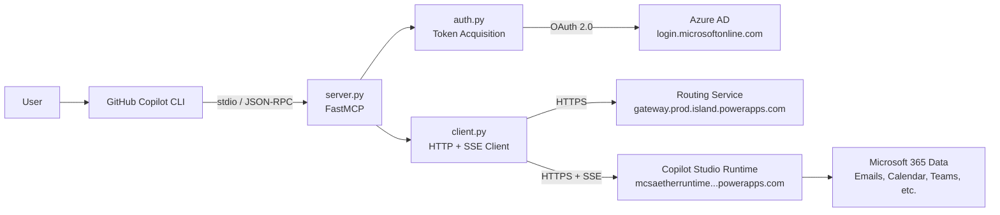
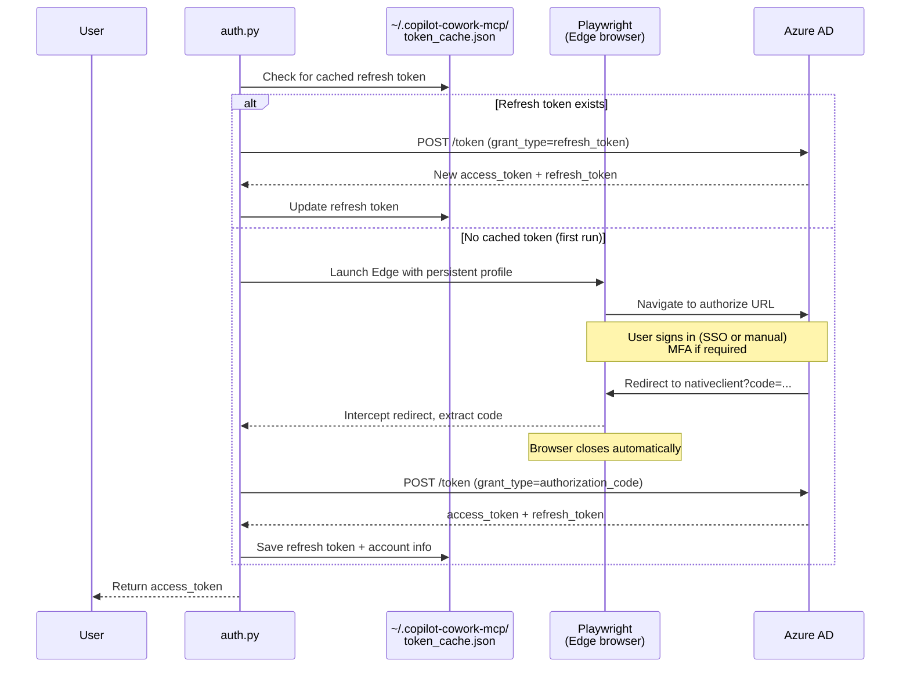
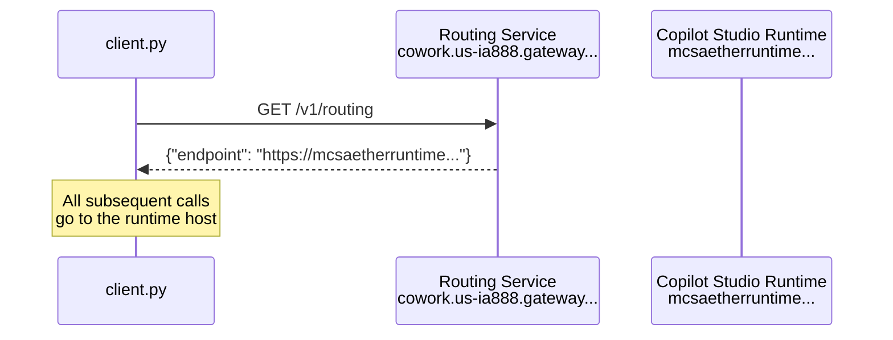
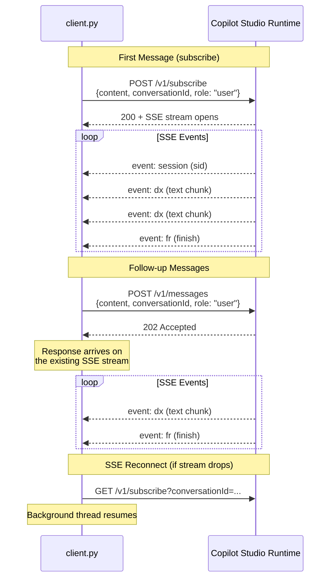
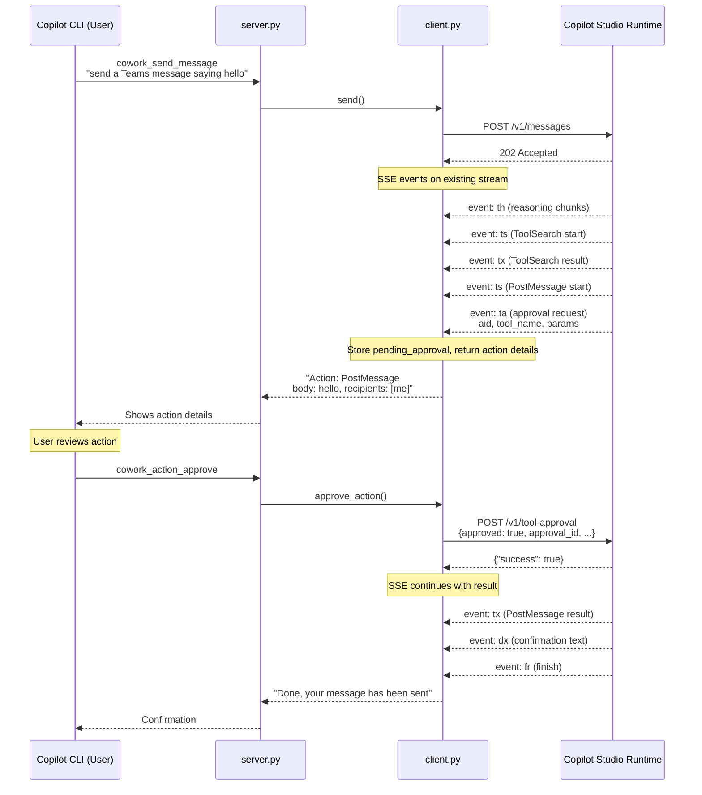

# Technical Documentation

This document explains the internals of the Copilot Cowork MCP server — how authentication works, how the Copilot Studio protocol works, and how the components fit together.

## System Architecture



## Authentication

### Token Requirements

The Copilot Studio runtime validates the `appid` claim in the JWT. These are Microsoft 1st-party public OAuth clients — the same app IDs used by the official Copilot web and desktop experiences:

| Client ID | Display Name | Used For | Notes |
|-----------|-------------|----------|-------|
| `c0ab8ce9-e9a0-42e7-b064-33d422df41f1` | M365ChatClient | Copilot web app (Cowork) | **Used by this project** |
| `96ff4394-9197-43aa-b393-6a41652e21f8` | Power Virtual Agents | Token audience (resource) | `aud` claim in JWT |

The token must have:
- `aud` = `96ff4394-9197-43aa-b393-6a41652e21f8`
- `scp` = `user_impersonation`
- `appid` = `c0ab8ce9-e9a0-42e7-b064-33d422df41f1`

### Auth Flow

We use the OAuth 2.0 Authorization Code flow with the Coworker app's registered `nativeclient` redirect URI. [Playwright](https://playwright.dev/python/) automates the browser sign-in and captures the auth code automatically — identical behavior on macOS, Linux, and Windows.



Playwright uses a persistent browser profile at `~/.copilot-cowork-mcp/browser_profile/`, so SSO cookies survive across sign-ins. If your Edge profile supports SSO, sign-in may complete without any manual interaction.

### Key OAuth Parameters

| Parameter | Value |
|-----------|-------|
| Redirect URI | `https://login.microsoftonline.com/common/oauth2/nativeclient` |
| Scope | `96ff4394-9197-43aa-b393-6a41652e21f8/user_impersonation openid profile offline_access` |
| Token endpoint | `https://login.microsoftonline.com/{tenant}/oauth2/v2.0/token` |
| Response mode | `query` |

### The Nativeclient Redirect

The `nativeclient` redirect page contains JavaScript that redirects to `/common/wrongplace` after 3 seconds:

```html
<script>
  var redirectUrl = 'https://login.microsoftonline.com/common/wrongplace';
  setTimeout(function() { window.location.replace(redirectUrl); }, 3000);
</script>
```

Playwright intercepts the redirect URL before the JavaScript fires, so the auth code is captured reliably regardless of platform.

### Refresh Token Lifecycle

- Refresh tokens are valid for approximately **90 days** with a sliding window
- Each use resets the 90-day clock
- Tokens are cached at:
  - macOS/Linux: `~/.copilot-cowork-mcp/token_cache.json` (mode 0600)
  - Windows: `%LOCALAPPDATA%\copilot-cowork-mcp\token_cache.json`

## Communication Protocol

The Cowork agent uses a REST + Server-Sent Events (SSE) protocol via the Copilot Studio runtime.

### Routing Discovery

Before any conversation, the client resolves its regional runtime endpoint:



### Conversation Flow



### SSE Event Types

| Event | Description | Data Format |
|-------|-------------|-------------|
| `session` | Session initialization | `{"sid": "..."}` |
| `dx` | Text delta (response chunk) | `{"t": "chunk text"}` |
| `fr` | Finish reason (end of one response) | `{}` |
| `th` | Thinking/reasoning chunk (action flows) | `{"c": "reasoning text"}` |
| `ta` | Tool approval request (action needs confirmation) | `{"tn": "mcp__server__Tool", "params": {...}, "aid": "approval_...", "to": 900}` |
| `ts` | Tool start (tool invocation begins) | `{"tn": "mcp__server__Tool", "inp": {...}}` |
| `tx` | Tool execution result | `{"tn": "...", "ok": true, "dur": 1234}` |
| `tk` | Task progress (initialization steps) | varies |
| `ti` | Title update | `{"t": "..."}` |
| `ps` | Progress status message | `{"t": "..."}` |
| `rl` | Status (started) | varies |
| `rh` | Response hint | varies |

### Action Flow (Send Message, Email, etc.)

When the user asks Copilot to perform an action (send a Teams message, send an email, schedule a meeting, etc.), the SSE event flow differs from a simple query. The MCP server uses a **two-step approval flow** — `cowork_send_message` returns the action details, and `cowork_action_approve` executes it after the user confirms:



### Tool Approval Body

```json
{
  "always_allow": false,
  "approval_id": "<aid from ta event>",
  "approved": true,
  "conversation_id": "<conversation_id>",
  "edited_input": { "body": "hello", "recipients": ["me"] },
  "scope": null,
  "server_name": "m365_teams",
  "session_id": "<conversation_id>",
  "tool_name": "PostMessage"
}
```

The `server_name` and `tool_name` are extracted from the full tool identifier in the `ta` event:
`mcp__m365_teams__PostMessage` → `server_name: "m365_teams"`, `tool_name: "PostMessage"`

### Required Headers

Both `Authorization` and `x-ms-weave-auth` must carry the same Bearer token:

```
Authorization: Bearer <jwt>
x-ms-weave-auth: Bearer <jwt>
Content-Type: application/json
Origin: https://m365.cloud.microsoft
x-conversation-id: <conversation_id>
```

### Message Body Format

```json
{
  "content": [{"text": "user message", "type": "text"}],
  "conversationId": "<tenant-id>:<user-oid>:<uuid>",
  "messageId": "<uuid>",
  "role": "user"
}
```

The `conversationId` is `{tenant_id}:{user_oid}:{random_uuid}`, extracted from JWT claims.

## Multi-Turn Architecture

The SSE connection from the first `subscribe` call stays open for all subsequent messages. A background thread reads events continuously and pushes completed responses to a thread-safe queue.

- **Follow-up messages**: Sent via `POST /v1/messages` (202 Accepted); responses arrive on the existing SSE stream
- **Auto-reconnect**: If the stream drops, the client reconnects via `GET /v1/subscribe?conversationId=...` with the last event ID
- **Finish event**: `fr` signals the end of one response, not the end of the stream — it stays alive for the next turn

